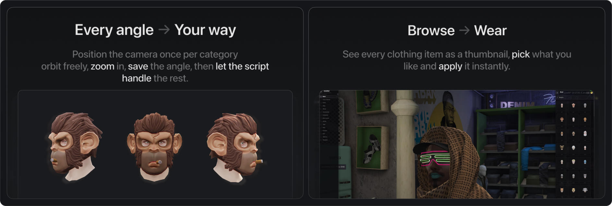

# uz_AutoShot

**All-in-one screenshot studio for FiveM. Captures clothing, vehicles, objects, and appearance overlays with transparent backgrounds.**

Iterates every drawable and texture variation automatically, removes the chroma key background server-side, and serves the results in a visual in-game browser. No external tools needed.



---

## How It Works

1. **`/shotmaker`** opens the capture studio. Your ped teleports to an underground void with chroma key walls and studio lighting. Pick what to capture from four tabs (clothing, appearance overlays, vehicles, or objects), adjust the orbit camera, and hit Start.
2. **Automatic capture** iterates every variation, applies it, waits for textures to stream, and takes a screenshot. The server removes the chroma key background and saves a transparent PNG.
3. **`/wardrobe`** opens a visual browser. Thumbnails load instantly via FiveM's native `cfx-nui` protocol, no external HTTP server needed.

---

## Features

- **Clothing & Props**: all 11 clothing components and 5 prop slots (hats, glasses, watches, etc.) with per-category camera framing
- **Appearance Overlays**: 12 head overlay categories including facial hair, eyebrows, makeup, blemishes, lipstick, and chest hair
- **Vehicle Capture**: auto-detects every loaded vehicle model, groups by class, with primary/secondary color picker
- **Object Capture**: world props (furniture, electronics, weapons, food, etc.) with configurable object list
- **Orbit Camera**: full camera control with rotate, roll, zoom, height, and FOV. Save angles per category, reused on future captures
- **Green Screen Studio**: configurable chroma key (green or magenta) with separate screen sizes for peds, vehicles, and objects
- **Transparent Backgrounds**: server-side chroma key removal with alpha feathering and despill. Pure JS, no native dependencies
- **Visual Wardrobe**: dual-panel browser with category sidebar, virtualized thumbnail grid, and search
- **Re-capture Mode**: select broken thumbnails in the wardrobe and re-shoot only those
- **Pause / Resume**: pause long capture sessions and pick up exactly where you left off
- **Quick Capture**: `/shotcar <model>` and `/shotprop <model>` for one-off captures without the full UI
- **HTTP API & Exports**: REST API for manifest queries, Lua exports for other scripts to consume photo URLs

---

## Requirements

- [screenshot-basic](https://github.com/citizenfx/screenshot-basic) *(included on most servers)*
- FiveM server artifacts with `yarn` support (built-in since 4892+)

---

## Installation

1. Drop `uz_AutoShot` into your `resources` folder.
2. Add to `server.cfg`:
   ```
   ensure screenshot-basic
   ensure uz_AutoShot
   ```
3. Node dependencies install automatically on first start via FiveM's built-in yarn.
4. The UI is pre-built, no build step required.

> **Important:** The resource folder must be named exactly `uz_AutoShot`. The resource will stop itself on startup if the name doesn't match.

---

## Commands

| Command | Description |
|---------|-------------|
| `/shotmaker` | Open capture studio. Select categories, adjust camera, start batch capture |
| `/wardrobe` | Open clothing browser. Browse thumbnails, apply items, re-capture broken shots |
| `/shotcar <model>` | Quick-capture a single vehicle by model name |
| `/shotprop <model>` | Quick-capture a single world prop by model name |

All commands require ACE permission by default. Set `Customize.AceRestricted = false` to disable.

### Granting Permissions

```cfg
# Per player
add_ace identifier.license:YOUR_LICENSE command.shotmaker allow
add_ace identifier.license:YOUR_LICENSE command.wardrobe allow
add_ace identifier.license:YOUR_LICENSE command.shotcar allow
add_ace identifier.license:YOUR_LICENSE command.shotprop allow

# Or via group
add_ace group.admin command allow
add_principal identifier.license:YOUR_LICENSE group.admin
```

---

## Camera Controls

| Key | Action |
|-----|--------|
| **Left Mouse** | Rotate around subject |
| **Right Mouse** | Roll camera |
| **Scroll Wheel** | Zoom in / out |
| **W / S** | Adjust camera height |
| **Q / E** | Adjust field of view |
| **R** | Reset camera to default |
| **C** | Copy current camera angle (saved per category) |

Saved angles persist for the session and are automatically applied when capturing that category.

---

## Configuration

All settings live in [`Customize.lua`](Customize.lua):

| Setting | Default | Description |
|---------|---------|-------------|
| `Customize.Command` | `'shotmaker'` | Capture command name |
| `Customize.MenuCommand` | `'wardrobe'` | Browser command name |
| `Customize.AceRestricted` | `false` | Require ACE permission for commands |
| `Customize.ScreenshotFormat` | `'png'` | Output format: `'png'`, `'webp'`, or `'jpg'` |
| `Customize.TransparentBg` | `true` | Chroma key removal (PNG only) |
| `Customize.ScreenshotWidth` | `512` | Output image width |
| `Customize.ScreenshotHeight` | `512` | Output image height |
| `Customize.CaptureAllTextures` | `false` | Capture all texture variants (not just default) |
| `Customize.ChromaKeyColor` | `'magenta'` | Background color: `'green'` or `'magenta'` |
| `Customize.BatchSize` | `10` | Captures per batch before cooldown |

Camera presets, green screen dimensions, studio lighting, clothing/prop/overlay categories, vehicle settings, and the object list are also configurable in the same file.

---

## API & Exports

### HTTP API (port `3959`)

| Method | Endpoint | Description |
|--------|----------|-------------|
| `GET` | `/api/manifest` | Full photo manifest |
| `GET` | `/api/manifest/:gender/:type/:id` | Filter by gender, type, and category ID |
| `GET` | `/api/exists?gender=&type=&id=&drawable=&texture=` | Check if a photo exists |
| `GET` | `/api/stats` | Photo count summary |

### Lua Exports

```lua
exports['uz_AutoShot']:getPhotoURL('male', 'component', 11, 5, 0)
-- → 'https://cfx-nui-uz_AutoShot/shots/male/11/5_0.png'

exports['uz_AutoShot']:getPhotoURL('male', 'overlay', 1, 3, 0)
-- → 'https://cfx-nui-uz_AutoShot/shots/male/overlay_1/3.png'

exports['uz_AutoShot']:getVehiclePhotoURL('adder')
-- → 'https://cfx-nui-uz_AutoShot/shots/vehicles/adder.png'

exports['uz_AutoShot']:getObjectPhotoURL('prop_bench_01a')
-- → 'https://cfx-nui-uz_AutoShot/shots/objects/prop_bench_01a.png'

exports['uz_AutoShot']:getShotsBaseURL()
-- → 'https://cfx-nui-uz_AutoShot/shots'

exports['uz_AutoShot']:getManifestURL('male', 'component', 11)
-- → 'http://127.0.0.1:3959/api/manifest/male/component/11'

exports['uz_AutoShot']:getPhotoFormat()
-- → 'png'
```

> Photo URLs use FiveM's `cfx-nui` protocol, no port forwarding needed. After generating new photos, restart the resource so FiveM indexes the new files.

---

## Output Structure

```
shots/
├── male/
│   ├── 2/               # Hair (componentId 2)
│   │   ├── 0_0.png      # drawable_texture
│   │   └── ...
│   ├── 11/              # Tops (componentId 11)
│   │   └── ...
│   ├── prop_0/          # Hats (propId 0)
│   │   └── ...
│   └── overlay_1/       # Facial Hair (overlayIndex 1)
│       ├── 0.png        # drawable
│       └── ...
├── female/
│   └── ...
├── vehicles/
│   ├── adder.png
│   └── ...
└── objects/
    ├── prop_bench_01a.png
    └── ...
```

---

## Troubleshooting

| Problem | Solution |
|---------|----------|
| Thumbnails appear black or blank | Ensure `screenshot-basic` starts before `uz_AutoShot` in `server.cfg`. Check for `Backend ready` message in server console. |
| Green/magenta fringe on edges | Switch `ChromaKeyColor` to `'magenta'`. Magenta produces cleaner edges on skin tones. |
| Wardrobe shows no thumbnails | Run `/shotmaker` first to generate images. Restart the resource after capture. |
| Resource stops with name error | Folder must be named exactly `uz_AutoShot` (case-sensitive on Linux). |
| Capture is too slow | Lower `ScreenshotWidth`/`Height` (e.g. `256`). Reduce wait times cautiously. Set `CaptureAllTextures = false`. |

---

## File Structure

```
uz_AutoShot/
├── client/client.lua          # Capture engine, orbit camera, NUI callbacks
├── server/server.js           # Image processing, chroma key, HTTP API
├── server/version.lua         # Auto version check
├── Customize.lua              # All configuration
├── fxmanifest.lua             # Resource manifest
├── resources/build/           # Pre-built UI (React + Vite)
└── shots/                     # Generated thumbnails (git-ignored)
```

---

## Our Other Work

UZ Scripts specializes in high-performance, developer-friendly scripts for the FiveM ecosystem. Explore our full collection: [uz-scripts.com/scripts](https://uz-scripts.com/scripts)

Full documentation: [uz-scripts.com/docs/free/uz-autoshot](https://uz-scripts.com/docs/free/uz-autoshot) · Discord: [discord.uz-scripts.com](https://discord.uz-scripts.com)

## License

Apache License 2.0. See [LICENSE](LICENSE) for details.
